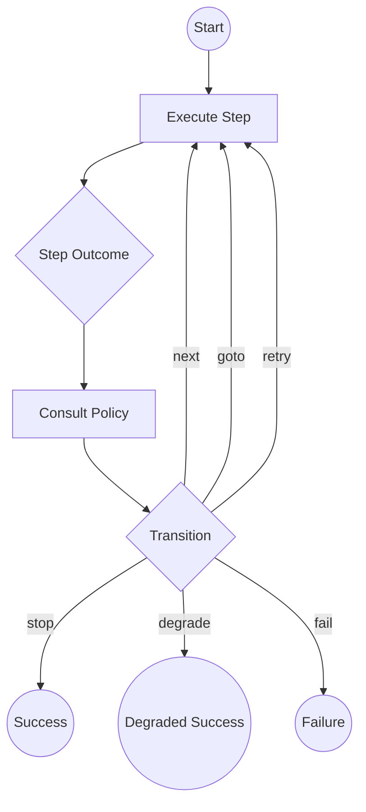

# Pipeline Orchestrator

A minimal, type-safe, Finite State Machine (FSM) powered framework for running step-based pipelines. Designed for complex workflows where control flow needs to be dynamic based on step results.

## Core Concepts

The orchestrator separates **execution logic** (Steps) from **routing logic** (Policies).

### 1. PipelineStep
A step is a discrete unit of work. It takes a context and returns an `outcome`.
*   **Outcome**: Describes *what* happened semantically (e.g., `ok`, `failed`, `redirect`). It should not decide *where* to go next.

### 2. PipelinePolicy
The policy is the "brain" of the pipeline. It looks at the outcome of the current step and decides the `transition`.
*   **Transition**: Describes *where* to go next (e.g., `next`, `goto`, `retry`, `stop`, `fail`, `degrade`).

### 3. PipelineOrchestrator
The engine that runs the loop. It manages the context, executes steps, consults the policy for transitions, and handles observability.

---

## Architecture Overview



---

## Implementation Guide

### Defining the Context
All pipelines must use a context that extends `BaseContext`.

```typescript
interface MyContext extends BaseContext {
  userId: string;
  data?: any;
  validationError?: string;
}
```

### Creating a Step
Extend the `PipelineStep` abstract class. Use status helpers like `ok()` and `failed()` for clean returns.

```typescript
import { PipelineStep, StepResult, ok, failed } from './orchestrator';

class ValidateInputStep extends PipelineStep<MyContext> {
  readonly name = 'validate-input';

  async run(ctx: MyContext): Promise<StepResult<MyContext>> {
    if (!ctx.userId) {
      return failed({ ctx, error: new Error('Missing User ID'), retryable: false });
    }
    return ok({ ctx });
  }
}
```

### Configuring the Pipeline
Assemble steps and optionally a custom policy.

```typescript
const orchestrator = new PipelineOrchestrator<MyContext>({
  steps: [
    new ValidateInputStep(),
    new FetchDataStep(),
    new ProcessDataStep()
  ],
  maxTransitions: 20 // Guard against infinite loops
});

const result = await orchestrator.run({ userId: '123', traceId: '...' });

if (result.status === 'ok') {
  console.log('Finished!', result.ctx, 'Degraded:', !!result.degraded);
} else {
  console.error('Failed:', result.error.message);
}
```

---

## Transitions & Control Flow

| Transition | Action | Result Status |
| :--- | :--- | :--- |
| `next` | Moves to the next step in the `steps` array. | - |
| `goto` | Jumps to a specific step by name. | - |
| `retry` | Re-executes a step (defaults to current step). | - |
| `stop` | Terminates execution immediately. | `ok` |
| `degrade` | Terminates execution immediately (graceful failure). | `ok` (with `degraded: true`) |
| `fail` | Terminates execution with an error. | `failed` |

## Advanced: Custom Policies
By default, `DefaultPolicy` handles `ok` (next) and `failed` (fail). You can extend it to handle custom logic like automatic retries or complex branching.

```typescript
class RetryPolicy extends DefaultPolicy<MyContext> {
  private retryCounts = new Map<string, number>();

  protected override fail(outcome: StepOutcomeFailed): Transition {
    const attempts = this.retryCounts.get('current') ?? 0;
    
    if (outcome.retryable && attempts < 3) {
      this.retryCounts.set('current', attempts + 1);
      return { type: 'retry' };
    }
    
    return super.fail(outcome);
  }

  override reset() {
    this.retryCounts.clear();
  }
}
```

## Observability
The `PipelineObserver` interface allows you to hook into every lifecycle event:
- `onRunStart` / `onRunFinish`
- `onStepStart` / `onStepFinish`
- `onError`

The `LoggerPipelineObserver` is provided out-of-the-box for structured logging.
